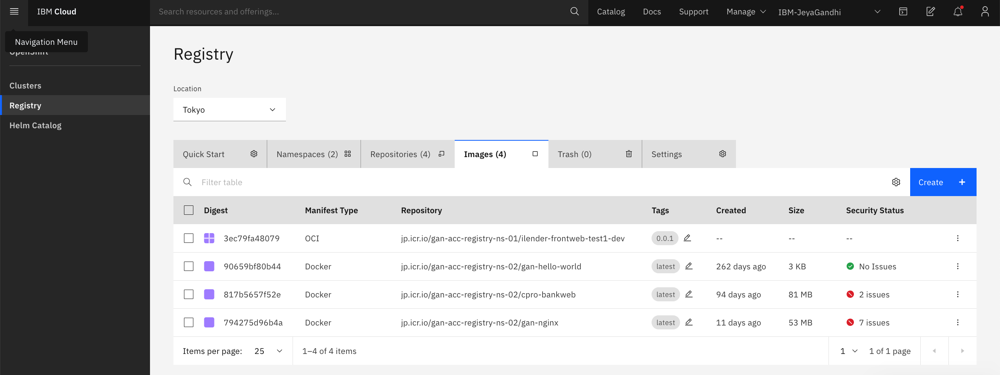

# Push Image to IBM Container Registry 

Images can be pushed to container registry in many ways.

### 1. Push image via Docker Push

#### Login into ibmcloud and docker.

```
ibmcloud login --sso
ibmcloud cr login
docker login -u iamapikey -p hHRW4wasdfasdfadsfadsfadsfadsfadsfUh jp.icr.io
```
Here we are using APIs key create in the previous steps to login.

####  Push the image to the container registry using docker.

```
docker pull gandhicloudlab/cpro-bankweb:latest
docker tag gandhicloudlab/cpro-bankweb:latest jp.icr.io/gan-acc-registry-ns-02/cpro-bankweb
docker push jp.icr.io/gan-acc-registry-ns-02/cpro-bankweb
```

####  images

Here is the registry images available as of now.


