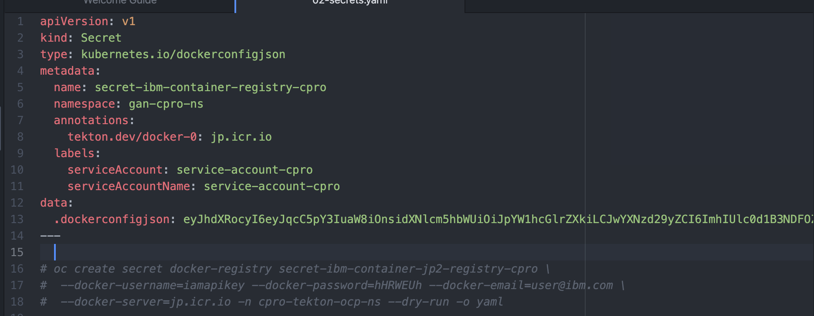
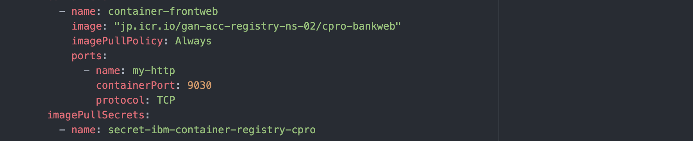

# Accessing Docker Image from IBM Container Registry for an application.

This cpro application is deployed in an OCP cluster in an account (IBM Gsi Labs).

This application is going to use image from IBM container Registry which is deployed in another account (IBM JeyaGandhi).

### 1. Create Container Registry

Refer : [Create Container Registry](01-create-container-registry) 

### 2. Push Image to Registry

Refer : [Push Image to Registry](02-push-image-to-registry) 

### 3. App Configuration for accessing Container registry 

1. Create docker secret with API Keys to access container registry.



2. Refer the docker secret in the `imagePullSecrets`.



### 4. Install the app

We are going to install this app in OCP cluster residing in different account, not in the same account where container registry is there.

1. Goto to the folder `install`

2. Run the command 

```
sh 01-install.sh
```

3. Access the Application

Access the applicaiton using the 'Routes' created under 'gan-cpro-ns'

